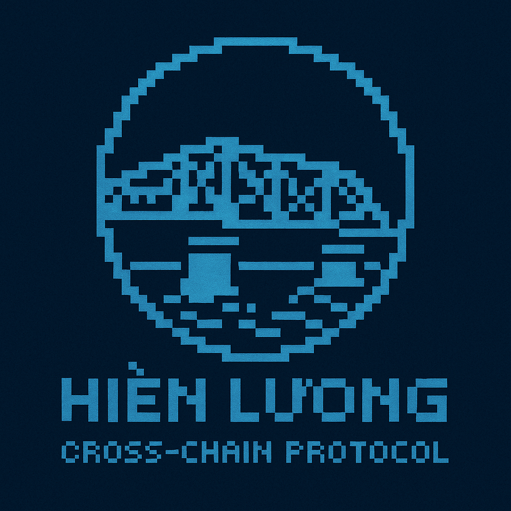

<div align="center">
  <a href="https://github.com/Peace-Foundation">
    
  </a>

  <h1>Hiền Lương - Hien Luong Bridge</h1>

  <p>
    <strong>Cross Chain Protocol</strong>
  </p>

  <!-- <p>
    <a href="https://docs.layerzero.network/v2"></a>
  </p> -->
</div>

Hien Luong is a Cross chain Protocol to connect blockchains to manage your digital assets anywhere in blockchains.

## Requirements

- `Node.js` - `>=18.16.0`
- `pnpm` (recommended) - or another package manager of your choice (npm, yarn)
- `forge` (optional) - `>=0.2.0` for testing, and if not using Hardhat for compilation

## Setup

- Copy `.env.example` into a new `.env`
- Set up your deployer address/account via the `.env`
  - You can specify either `MNEMONIC` or `PRIVATE_KEY`:

    ```
    MNEMONIC="test test test test test test test test test test test junk"
    or...
    PRIVATE_KEY="0xabc...def"
    ```

- Fund this deployer address/account with the native tokens of the chains you want to deploy to. This example by default will deploy to the following chains' testnets: **Optimism Sepolia** and **Arbitrum Sepolia**.

## Build

### Compiling your contracts

This project supports both `hardhat` and `forge` compilation. By default, the `compile` command will execute both:

```bash
pnpm compile
```

If you prefer one over the other, you can use the tooling-specific commands:

```bash
pnpm compile:forge
pnpm compile:hardhat
```

## Deploy

To deploy the OApp contracts to your desired blockchains, run the following command:

```bash
pnpm hardhat lz:deploy --tags MyOApp
```

Select all the chains you want to deploy the OApp to.
