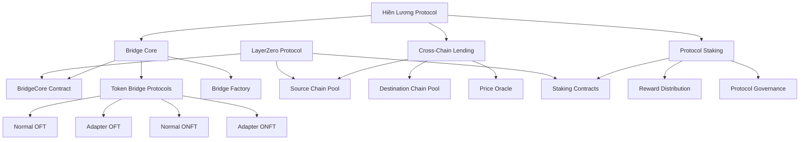
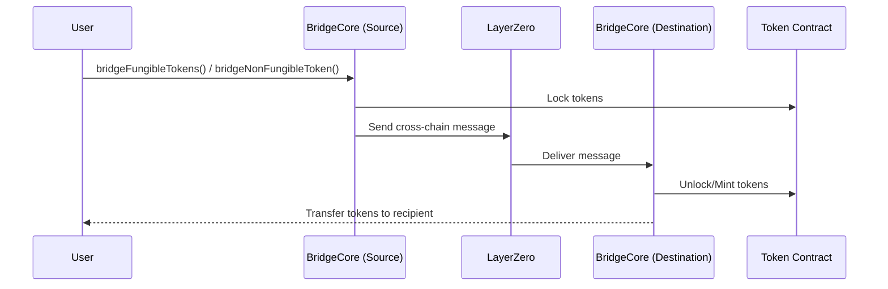

<div align="center">
  <a href="https://github.com/Peace-Foundation">
    
  </a>

  <h1>Hiền Lương - Architecture</h1>

  <p>
    <strong>Cross Chain Protocol Design</strong>
  </p>
</div>

## System Architecture

Hiền Lương Bridge is built with a modular architecture that separates concerns between different components while maintaining secure communication between them. The protocol consists of three main pillars:



## Bridge Core

The Bridge Core is the central component of the Hiền Lương Protocol, handling cross-chain token transfers for both fungible and non-fungible tokens.

### Key Components

1. **BridgeCore Contract**: The main contract that coordinates token bridging operations
   - Manages bridge instances
   - Tracks registered tokens
   - Handles message passing between chains via LayerZero
   - Implements security measures and access controls

2. **Token Bridge Protocols**: Specialized contracts for different token types
   - **NormalOFT**: Creates new fungible token representations on destination chains
   - **AdapterOFT**: Adapts existing fungible tokens for cross-chain transfers
   - **NormalONFT**: Creates new non-fungible token representations on destination chains
   - **AdapterONFT**: Adapts existing non-fungible tokens for cross-chain transfers

3. **BridgeFactory**: Contract factory for easy deployment of bridge-related contracts
   - Streamlines the process of creating new bridge instances
   - Ensures standardized configuration of all bridge components

### Data Structures

The protocol uses several key data structures to track bridging operations:

```solidity
// Fungible token information
struct FungibleTokenData {
  address contractAddress;
  bool needAdaptation;
  bool isRegistered;
  uint256 totalBridged;
}

// Non-fungible token information
struct NonFungibleTokenData {
  address contractAddress;
  bool needAdaptation;
  bool isRegistered;
  uint256 totalBridged;
}

// Bridge instance data
struct BridgeData {
  address owner;
  uint256 bridgeId;
  string name;
  string description;
  uint256 createdAt;
  bool isActive;
  uint256 totalTransactions;
}

// Cross-chain message format
struct BridgeMessage {
  uint256 bridgeId;
  address tokenAddress;
  uint256 amount;
  uint256 tokenId;
  address from;
  address to;
  bool isFungible;
}
```

### Flow Diagram

The bridging process follows these steps:



## Cross-Chain Lending

The lending protocol enables users to utilize their assets across multiple chains for borrowing and lending activities.

### Key Components

1. **SourcePool**: The lending pool on the source chain
   - Manages deposits and withdrawals
   - Tracks user positions
   - Initiates cross-chain lending operations

2. **DestinationPool**: The corresponding pool on the destination chain
   - Receives cross-chain lending instructions
   - Handles borrowing operations
   - Manages collateral and interest rates

3. **Oracle**: Price oracle for lending operations
   - Provides reliable price feeds across chains
   - Ensures accurate collateralization ratios
   - Helps prevent exploits and manipulation

## Protocol Staking

The staking mechanism secures the protocol and provides incentives for participants.

### Key Components

1. **Staking Contracts**: Manage the staking of protocol tokens
   - Track staker positions
   - Lock tokens for security
   - Distribute rewards to participants

2. **Reward Distribution**: Handle the issuance and distribution of rewards
   - Calculate rewards based on participation
   - Distribute rewards on a regular schedule
   - Support cross-chain reward claiming

3. **Protocol Governance**: Enable stakeholders to participate in protocol governance
   - Proposal creation and voting
   - Parameter adjustment
   - Protocol upgrades

## LayerZero Integration

Hiền Lương Bridge leverages the LayerZero protocol for secure cross-chain communication:

- Uses the OApp standard for consistent message passing
- Implements proper peer management across different chains
- Configures appropriate gas limits for cross-chain execution
- Utilizes the endpoint messaging system for reliable delivery

## Security Considerations

The protocol implements several security measures:

1. **Token Validation**: All tokens are validated before bridging operations
2. **Bridge Instance Controls**: Only authorized users can create and manage bridges
3. **Gas Limit Configuration**: Proper gas limits for cross-chain execution
4. **Error Handling**: Robust error handling to prevent failed transactions
5. **Access Controls**: Role-based permissions for administrative functions

## Future Enhancements

The architecture is designed to support several planned enhancements:

1. **Multi-Chain Support**: Extend beyond initial chains to support all major networks
2. **Advanced Token Standards**: Support for additional token standards (ERC1155, etc.)
3. **Cross-Chain DAOs**: Infrastructure for decentralized organizations across chains
4. **Privacy Features**: Implementations for private cross-chain transfers
5. **Layer 2 Optimization**: Specialized support for Layer 2 scaling solutions
