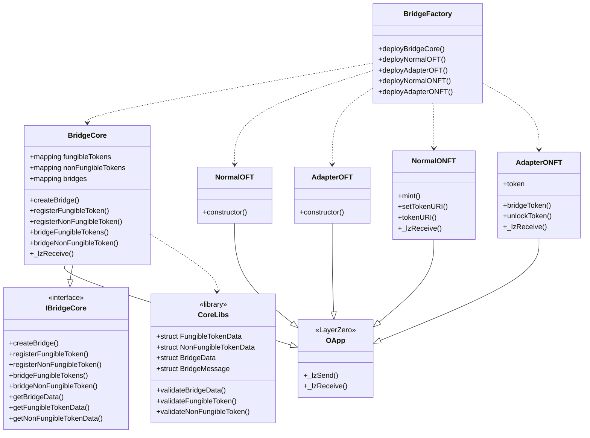
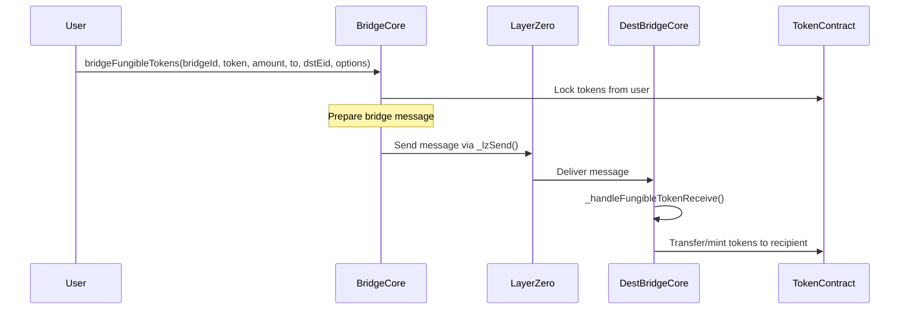
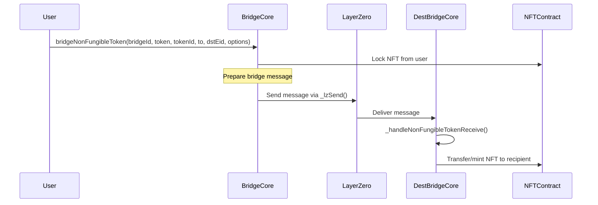

<div align="center">
  <a href="https://github.com/Peace-Foundation">
    
  </a>

  <h1>Hiền Lương Bridge - Core Bridge Component</h1>

  <p>
    <strong>Cross-Chain Asset Bridge Implementation</strong>
  </p>
</div>

# Bridge Core Documentation

## Overview

The Bridge Core component of the Hiền Lương protocol enables the secure and reliable transfer of digital assets between different blockchain networks. The bridge supports both fungible tokens (ERC20) and non-fungible tokens (ERC721) using two distinct bridging strategies:

1. **Normal Mode**: Creates new token representations on destination chains
2. **Adapter Mode**: Bridges existing tokens between chains

## Contract Architecture

The bridge implementation consists of several interconnected contracts:



### BridgeCore

The central contract that manages bridge instances and coordinates token transfers across chains.

#### Key Functions

- `createBridge(string name, string description)`: Creates a new bridge instance
- `registerFungibleToken(address tokenAddress, bool needAdaptation)`: Registers a fungible token for bridging
- `registerNonFungibleToken(address tokenAddress, bool needAdaptation)`: Registers a non-fungible token for bridging
- `bridgeFungibleTokens(...)`: Bridges fungible tokens to another chain
- `bridgeNonFungibleToken(...)`: Bridges non-fungible tokens to another chain
- `_lzReceive(...)`: Handles incoming LayerZero messages

### Token Contracts

#### NormalOFT

Creates new fungible token representations on destination chains.

```solidity
contract NormalOFT is OFT {
  // Inherits functionality from LayerZero's OFT implementation
  constructor(
    address _endpointAddress,
    string memory tokenName,
    string memory tokenSymbol,
    uint8 tokenDecimals,
    address _owner
  ) OFT(tokenName, tokenSymbol, tokenDecimals, _endpointAddress, _owner) {}
}
```

#### AdapterOFT

Adapts existing fungible tokens for cross-chain transfers.

```solidity
contract AdapterOFT is ProxyOFT {
  constructor(
    address _token,
    address _endpointAddress,
    address _owner
  ) ProxyOFT(_token, _endpointAddress, _owner) {}
}
```

#### NormalONFT

Creates new non-fungible token representations on destination chains.

```solidity
contract NormalONFT is OApp, ERC721, Ownable {
  // Token URI management
  mapping(uint256 => string) private _tokenURIs;

  // Core functions for NFT management
  function mint(
    address to,
    string memory uri
  ) public onlyOwner returns (uint256);
  function setTokenURI(uint256 tokenId, string memory uri) public onlyOwner;
  function tokenURI(
    uint256 tokenId
  ) public view override returns (string memory);

  // LayerZero integration
  function _lzReceive(
    uint32 _srcEid,
    bytes32 _srcAddress,
    bytes calldata _payload
  ) internal override;
}
```

#### AdapterONFT

Adapts existing non-fungible tokens for cross-chain transfers.

```solidity
contract AdapterONFT is OApp, Ownable {
  // The NFT contract this adapter wraps
  IERC721 public immutable token;

  // Tracking for locked tokens
  mapping(uint256 => address) private _originalOwners;

  // Core bridging functions
  function bridgeToken(
    uint256 tokenId,
    address to,
    uint32 dstEid,
    bytes calldata options
  ) external payable;
  function unlockToken(uint256 tokenId) external;

  // LayerZero integration
  function _lzReceive(
    uint32 _srcEid,
    bytes32 _srcAddress,
    bytes calldata _payload
  ) internal override;
}
```

## Bridging Process

### Fungible Token Bridging



### Non-Fungible Token Bridging



## Bridge Modes

### Normal Mode

In Normal Mode, the bridge creates new token representations on destination chains:

1. Source chain: User deposits original tokens into the bridge
2. Bridge locks the original tokens in the source chain contract
3. Bridge sends a message to the destination chain
4. Destination chain: Bridge mints corresponding tokens to the recipient

### Adapter Mode

In Adapter Mode, the bridge connects existing tokens across chains:

1. Source chain: User deposits tokens into the adapter contract
2. Adapter locks the tokens and records the original owner
3. Adapter sends a message to the destination chain
4. Destination chain: Adapter unlocks or transfers the corresponding tokens to the recipient

## Security Considerations

The bridge implementation incorporates several security measures:

1. **Token Validation**: All tokens are validated before bridging operations
2. **Bridge Authentication**: Only authorized users can create and manage bridges
3. **Proper Gas Configuration**: Appropriate gas limits for cross-chain message execution
4. **Error Handling**: Comprehensive error handling for failed transactions
5. **Event Emission**: Detailed events for tracking and auditing bridge operations

## Usage Examples

### Creating a Bridge Instance

```solidity
// Create a new bridge instance
uint256 bridgeId = bridgeCore.createBridge("My ETH-ARB Bridge", "Bridge between Ethereum and Arbitrum");
```

### Registering Tokens

```solidity
// Register a fungible token for bridging (normal mode)
bridgeCore.registerFungibleToken(tokenAddress, false);

// Register a fungible token for bridging (adapter mode)
bridgeCore.registerFungibleToken(existingTokenAddress, true);

// Register a non-fungible token for bridging
bridgeCore.registerNonFungibleToken(nftAddress, false);
```

### Bridging Tokens

```solidity
// Bridge fungible tokens
bridgeCore.bridgeFungibleTokens(
    bridgeId,
    tokenAddress,
    amount,
    recipientAddress,
    destinationChainEid,
    options
);

// Bridge non-fungible token
bridgeCore.bridgeNonFungibleToken(
    bridgeId,
    nftAddress,
    tokenId,
    recipientAddress,
    destinationChainEid,
    options
);
```

## Future Enhancements

The bridge architecture is designed to support future enhancements:

1. **Multi-Token Transfers**: Support for batched transfers of multiple tokens
2. **Fee Mechanisms**: Advanced fee models for protocol sustainability
3. **Custom Bridge Logic**: Extensible bridge logic for specialized use cases
4. **Enhanced Security Features**: Additional security measures for high-value transfers
5. **Cross-Chain Hooks**: Custom hooks for executing logic on token bridging
