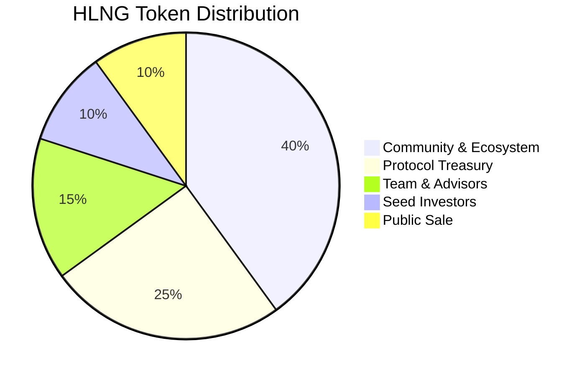
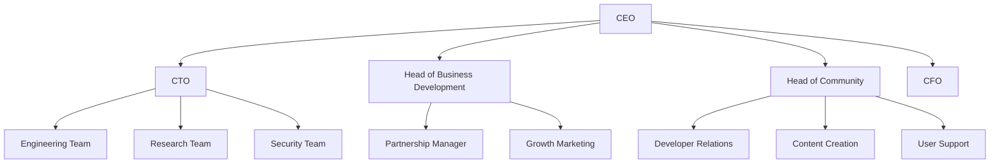
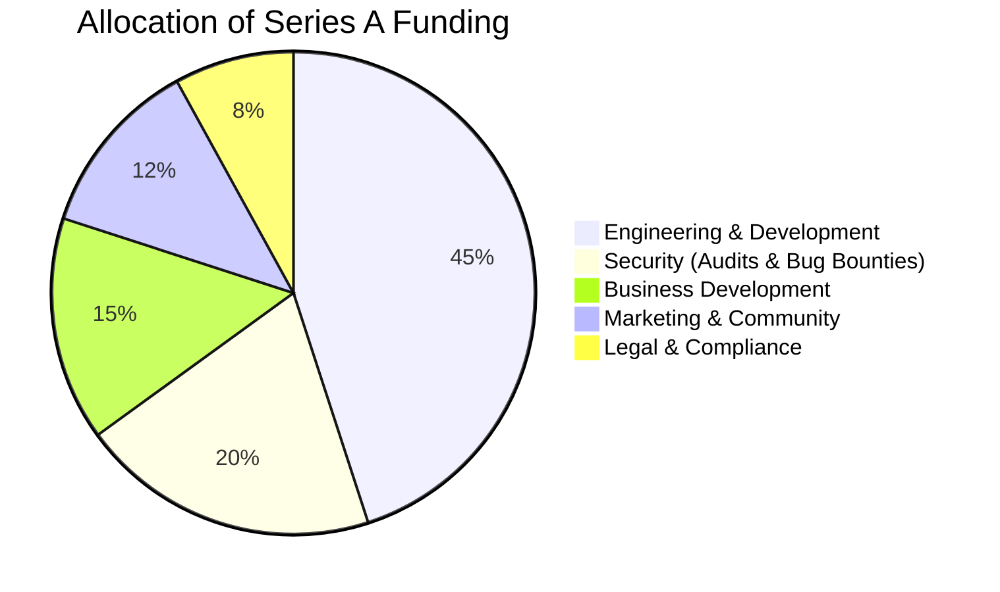

# Hiền Lương Bridge - Business Plan

  
  <h2>Connecting Blockchain Ecosystems</h2>

## Executive Summary

Hiền Lương Bridge is building a comprehensive cross-chain protocol that enables seamless asset transfers, cross-chain lending, and protocol staking across multiple blockchain networks. Named after the historic bridge that once connected North and South Vietnam, our protocol aims to unite fragmented blockchain ecosystems, allowing digital assets to flow freely between networks while maintaining security and efficiency.

With the blockchain landscape increasingly moving toward a multi-chain paradigm, the need for reliable cross-chain infrastructure has never been greater. Hiền Lương Bridge addresses this need with a unique combination of features:

1. **Integrated Bridge Protocol** - Secure token transfers across chains
2. **Cross-Chain Lending** - Utilize collateral on one chain to borrow on another
3. **Protocol Staking** - Security and governance layer to align incentives

Our team combines technical expertise in blockchain infrastructure with a vision for a more connected decentralized ecosystem. This business plan outlines our strategy for developing, launching, and growing the Hiền Lương Bridge protocol to become a fundamental piece of cross-chain infrastructure.

## Market Opportunity

### Market Size and Growth

The cross-chain bridge market has grown exponentially:

- **TVL in Bridges**: $29.8B as of early 2025, projected to reach $147B+ by 2027
- **Monthly Transaction Volume**: $37B+ across major bridges
- **User Growth**: 280% year-over-year increase in unique bridge users

### Market Drivers

1. **Multi-Chain Reality**: The blockchain ecosystem has evolved to a multi-chain paradigm
2. **Fragmented Liquidity**: $235B+ in total DeFi TVL spread across dozens of chains
3. **L2 Proliferation**: Rapid growth of Layer 2 solutions requiring cross-chain connectivity
4. **Developer Need**: Growing demand for simplified cross-chain development tooling
5. **Institutional Interest**: Increasing institutional adoption of digital assets across networks

### Target Market Segments

1. **DeFi Power Users**: Active users managing portfolios across multiple chains
2. **DeFi Protocols & DAOs**: Organizations requiring cross-chain operations
3. **Developers**: Builders creating multi-chain applications
4. **Institutional Users**: Funds and organizations requiring cross-chain treasury management

## Value Proposition

Hiền Lương Bridge differentiates itself from existing solutions through:

1. **Unified Protocol Stack**: Integrated bridge, lending, and staking in one ecosystem
2. **Cross-Chain Capital Efficiency**: Use collateral on one chain to borrow on another
3. **Dual Bridge Strategy**: Both normal (new token representations) and adapter (existing token) modes
4. **Developer-First Approach**: Comprehensive SDK and simplified integration experience
5. **Security-First Implementation**: Multiple layers of security with focus on auditability

## Business Model

### Revenue Streams

Hiền Lương Bridge will generate revenue through several mechanisms:

1. **Bridge Fees**: Small percentage fee (0.05%-0.1%) on all cross-chain transfers
2. **Lending Interest Spread**: Portion of interest rate spread from lending protocol
3. **Protocol Services**: Premium features for institutional and enterprise users
4. **Integration Partnerships**: Revenue share from strategic protocol integrations

### Fee Structure Projection

| Service             | Fee Mechanism        | Est. Annual Revenue (Year 3) |
| ------------------- | -------------------- | ---------------------------- |
| Bridge Transactions | 0.07% per transfer   | $8.4M                        |
| Lending Interest    | 10% of spread        | $5.2M                        |
| Premium Services    | Subscription + usage | $2.8M                        |
| Integration Revenue | Partnership specific | $3.5M                        |
| **Total**           |                      | **$19.9M**                   |

### Token Economics

The HLNG token serves multiple purposes in the ecosystem:

1. **Governance**: Voting rights for protocol parameters and upgrades
2. **Fee Discounts**: Reduced fees for token holders
3. **Staking Rewards**: Share of protocol revenue for stakers
4. **Collateral**: Enhanced LTV ratios when used as collateral
5. **Protocol Security**: Economic security layer for the bridge

### Token Distribution

- **Total Supply**: 1,000,000,000 HLNG
- **Initial Circulating Supply**: 150,000,000 HLNG (15%)
- **Vesting Schedule**: 4-year vesting for team and investors with 1-year cliff

## Go-to-Market Strategy

### Phase 1: Foundation (Q3-Q4 2025)

- Launch core bridge functionality on Optimism and Arbitrum
- Focus on security track record with multiple audits
- Build initial community through targeted DeFi user acquisition
- Establish developer resources and documentation

### Phase 2: Growth (Q1-Q2 2026)

- Launch cross-chain lending protocol
- Expand to additional EVM chains
- Strategic partnerships with major DeFi protocols
- Developer grants program to build ecosystem

### Phase 3: Expansion (Q3-Q4 2026)

- Launch staking and governance
- Expand to non-EVM chains
- Enterprise and institutional solutions
- Advanced privacy features

### Marketing Strategy

1. **Community Building**
   - AMAs with team and developers
   - Educational content on cross-chain operations
   - Hackathons to encourage developer adoption

2. **Strategic Partnerships**
   - DeFi protocol integrations
   - Wallet and exchange partnerships
   - Developer tooling collaborations

3. **Content & Education**
   - Tutorials and guides
   - Cross-chain development courses
   - Market research publications

4. **Growth Initiatives**
   - Targeted liquidity mining programs
   - Bridge usage incentives
   - Developer grants

## Team & Organization

### Core Team

- **Founder & CEO**: [Name] - 10+ years in blockchain infrastructure
- **CTO**: [Name] - Former lead developer at [major protocol]
- **Head of Research**: [Name] - PhD in Distributed Systems
- **Head of Business Development**: [Name] - Former VP at [major exchange]
- **Head of Community**: [Name] - Built community for [successful DeFi project]

### Advisors

- [Name] - Founder of [successful DeFi protocol]
- [Name] - Security researcher, discovered vulnerabilities in multiple bridges
- [Name] - Economics professor specializing in token models
- [Name] - Former regulator with expertise in compliance

### Organizational Structure

## Financial Projections

### 5-Year Financial Forecast

| Metric        | Year 1 | Year 2 | Year 3 | Year 4 | Year 5 |
| ------------- | ------ | ------ | ------ | ------ | ------ |
| Bridge Volume | $2.5B  | $12B   | $42B   | $95B   | $180B  |
| Lending TVL   | $0.3B  | $2.2B  | $8.5B  | $22B   | $45B   |
| Revenue       | $0.8M  | $6.2M  | $19.9M | $48M   | $87M   |
| Expenses      | $3.2M  | $7.8M  | $12.5M | $18.2M | $28.5M |
| Net Income    | -$2.4M | -$1.6M | $7.4M  | $29.8M | $58.5M |

### Funding Requirements

| Round    | Amount | Timing    | Purpose                                       |
| -------- | ------ | --------- | --------------------------------------------- |
| Seed     | $3M    | Completed | Initial development, team building            |
| Series A | $12M   | Q3 2025   | Bridge launch, expansion to additional chains |
| Series B | $30M   | Q2 2026   | Lending protocol, institutional features      |

### Use of Funds

## Risk Analysis & Mitigation

### Technical Risks

| Risk                | Likelihood | Impact | Mitigation Strategy                                           |
| ------------------- | ---------- | ------ | ------------------------------------------------------------- |
| Bridge Exploit      | Medium     | Severe | Multiple security audits, formal verification, insurance fund |
| Smart Contract Bugs | Medium     | High   | Extensive testing, bug bounty program, gradual rollout        |
| Network Congestion  | High       | Medium | Dynamic fee mechanism, alternative messaging layers           |
| Oracle Failures     | Medium     | High   | Multiple oracle sources, circuit breakers                     |

### Business Risks

| Risk               | Likelihood | Impact | Mitigation Strategy                                                      |
| ------------------ | ---------- | ------ | ------------------------------------------------------------------------ |
| Regulatory Changes | High       | High   | Compliance-first approach, legal advisors, jurisdictional diversity      |
| Competition        | High       | Medium | First-mover advantage in integrated stack, focus on developer experience |
| Market Downturn    | Medium     | Medium | Conservative treasury management, diversified revenue sources            |
| User Adoption      | Medium     | High   | Strategic partnerships, incentive programs, excellent UX                 |

## Competitive Advantage

Hiền Lương Bridge maintains sustainable competitive advantages through:

1. **Full-Stack Integration**: The only protocol combining bridge, lending, and staking
2. **Capital Efficiency Innovation**: Cross-chain collateralization creates unique value
3. **Security Architecture**: Multi-layered approach with formal verification
4. **Developer Ecosystem**: Comprehensive tools reducing time-to-market for integrations
5. **Strategic Partnerships**: Exclusive integrations with key protocols

## Long-Term Vision

In five years, Hiền Lương Bridge aims to be:

1. **Infrastructure Layer**: A fundamental part of blockchain infrastructure
2. **Multi-Chain Standard**: The standard protocol for cross-chain operations
3. **Developer Platform**: The go-to platform for cross-chain application development
4. **Institutional Solution**: Trusted by institutions for cross-chain operations
5. **Protocol DAO**: A fully decentralized organization governed by stakeholders

## Conclusion

Hiền Lương Bridge represents a significant opportunity to build critical infrastructure for the multi-chain future of blockchain. By combining secure bridge functionality with innovative cross-chain financial products, we are positioned to capture substantial value in a rapidly growing market.

Our phased approach to development and expansion, focus on security, and emphasis on developer experience create a strong foundation for sustainable growth. With a clear business model and experienced team, Hiền Lương Bridge is poised to become a fundamental component of the cross-chain ecosystem.

## Appendices

1. **Detailed Technical Roadmap**
2. **Token Economics Paper**
3. **Security Architecture**
4. **Competitive Analysis**
5. **Market Research Data**
