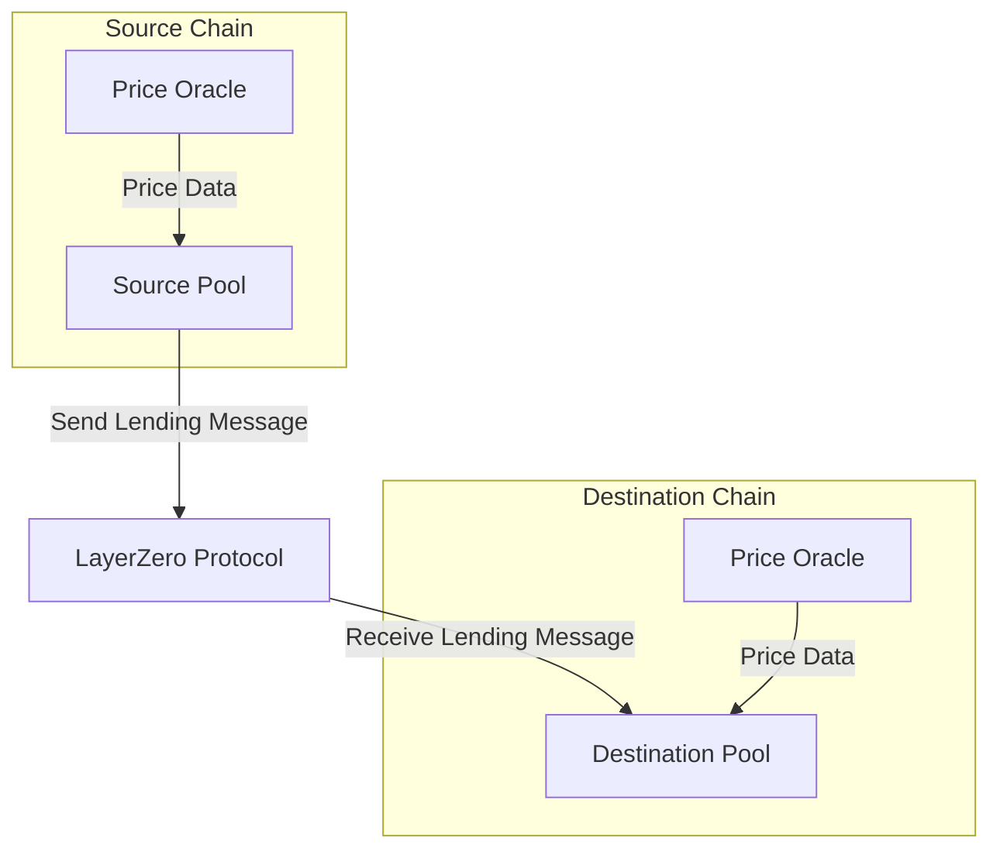
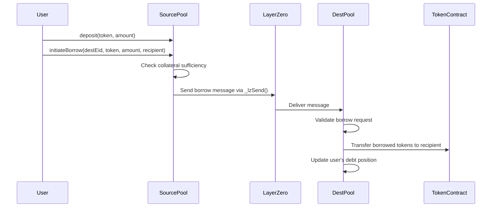
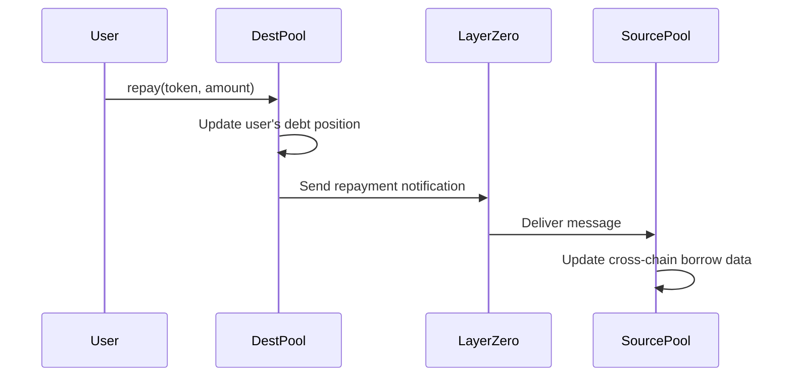
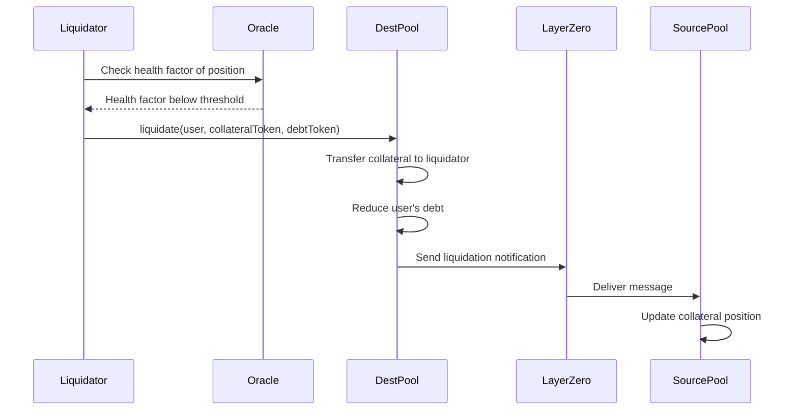

<div align="center">
  <a href="https://github.com/Peace-Foundation">
    
  </a>

  <h1>Hiền Lương Bridge - Lending Protocol</h1>

  <p>
    <strong>Cross-Chain Lending System</strong>
  </p>
</div>

# Cross-Chain Lending Documentation

## Overview

The Lending Protocol within the Hiền Lương Bridge ecosystem enables users to access liquidity across different blockchain networks. This component allows users to deposit assets on one chain and borrow against that collateral on another chain, creating a truly unified cross-chain capital market.

## System Architecture

The cross-chain lending protocol consists of three main components:



### Key Components

1. **Source Pool**: Manages deposits and collateral on the source chain
   - Handles user deposits
   - Tracks collateral positions
   - Initiates cross-chain lending operations
   - Manages interest rates for depositors

2. **Destination Pool**: Handles borrowing on the destination chain
   - Processes cross-chain borrowing requests
   - Manages debt positions
   - Calculates interest and fees
   - Handles liquidations when necessary

3. **Price Oracle**: Provides reliable price feeds for assets
   - Ensures accurate collateral valuation
   - Monitors health factors for positions
   - Triggers liquidations when positions become undercollateralized

## Contract Design

### SourcePool Contract

The SourcePool contract manages user deposits and collateral on the source chain.

```solidity
contract SourcePool is OApp {
  // Supported assets for deposits
  mapping(address => bool) public supportedAssets;

  // User deposit data
  mapping(address => mapping(address => uint256)) public userDeposits; // user => token => amount

  // Cross-chain borrowing data
  mapping(address => mapping(uint32 => mapping(address => uint256)))
    public crossChainBorrows;
  // user => destEid => token => borrowed amount

  // Events
  event Deposit(address indexed user, address indexed token, uint256 amount);
  event WithdrawCollateral(
    address indexed user,
    address indexed token,
    uint256 amount
  );
  event InitiateBorrow(
    address indexed user,
    uint32 destEid,
    address indexed token,
    uint256 amount
  );

  // Core functions
  function deposit(address token, uint256 amount) external;
  function withdrawCollateral(address token, uint256 amount) external;
  function initiateBorrow(
    uint32 destEid,
    address token,
    uint256 amount,
    address recipient
  ) external payable;
  function _lzReceive(
    uint32 _srcEid,
    bytes32 _srcAddress,
    bytes calldata _payload
  ) internal override;
}
```

### DestinationPool Contract

The DestinationPool contract handles borrowing operations on the destination chain.

```solidity
contract DestinationPool is OApp {
  // Supported assets for borrowing
  mapping(address => bool) public supportedBorrowAssets;

  // User borrow data
  mapping(address => mapping(address => uint256)) public userBorrows; // user => token => amount

  // Interest rate models
  mapping(address => InterestRateModel) public interestRateModels;

  // Events
  event Borrow(address indexed user, address indexed token, uint256 amount);
  event Repay(address indexed user, address indexed token, uint256 amount);
  event Liquidate(
    address indexed user,
    address indexed liquidator,
    address indexed token,
    uint256 amount
  );

  // Core functions
  function executeBorrow(address user, address token, uint256 amount) external;
  function repay(address token, uint256 amount) external;
  function liquidate(
    address user,
    address collateralToken,
    address debtToken
  ) external;
  function _lzReceive(
    uint32 _srcEid,
    bytes32 _srcAddress,
    bytes calldata _payload
  ) internal override;
}
```

### Oracle Contract

The Oracle contract provides price data for assets in the lending protocol.

```solidity
contract Oracle {
  // Price feed interfaces
  mapping(address => AggregatorV3Interface) public priceFeeds;

  // Events
  event PriceFeedUpdated(address indexed token, address indexed feed);

  // Core functions
  function getPrice(address token) external view returns (uint256);
  function updatePriceFeed(address token, address feed) external;
  function getHealthFactor(
    address user,
    address[] memory collateralTokens,
    address[] memory debtTokens
  ) external view returns (uint256);
}
```

## Lending Process

### Cross-Chain Borrowing Flow



### Repayment Flow



### Liquidation Process



## Interest Rate Models

The protocol implements dynamic interest rate models to ensure optimal capital efficiency:

```solidity
struct InterestRateModel {
  uint256 baseRate; // Base interest rate
  uint256 multiplier; // Rate multiplier based on utilization
  uint256 jumpMultiplier; // Multiplier after utilization jump
  uint256 jumpUtilization; // Utilization rate where jump occurs
}

function calculateBorrowRate(
  InterestRateModel memory model,
  uint256 utilization
) public pure returns (uint256) {
  if (utilization <= model.jumpUtilization) {
    return model.baseRate + (utilization * model.multiplier) / 1e18;
  } else {
    uint256 normalRate = model.baseRate +
      (model.jumpUtilization * model.multiplier) /
      1e18;
    uint256 excessUtil = utilization - model.jumpUtilization;
    return normalRate + (excessUtil * model.jumpMultiplier) / 1e18;
  }
}
```

## Risk Management

The protocol includes several risk management features:

1. **Collateralization Ratios**: Each asset has a specific collateralization ratio
2. **Liquidation Thresholds**: Positions are liquidated when they fall below the threshold
3. **Liquidation Incentives**: Liquidators receive a bonus for performing liquidations
4. **Borrowing Limits**: Maximum borrowing amounts for each asset
5. **Price Oracle Security**: Multiple price feeds with deviation checks

## Protocol Parameters

| Parameter             | Description                                      | Default Value  |
| --------------------- | ------------------------------------------------ | -------------- |
| Collateral Factor     | Maximum borrowing power of a specific collateral | 75%            |
| Liquidation Threshold | When positions can be liquidated                 | 80%            |
| Liquidation Bonus     | Bonus paid to liquidators                        | 8%             |
| Reserve Factor        | Portion of interest retained as reserves         | 10%            |
| Borrow Cap            | Maximum amount that can be borrowed              | Asset-specific |

## Security Considerations

The lending protocol implements several security measures:

1. **Secure Oracle Integration**: Using reliable price feeds with fallback mechanisms
2. **Rate Limiting**: Limits on borrowing volume to prevent rapid exploitation
3. **Emergency Shutdown**: Ability to pause the protocol in case of emergencies
4. **Cross-Chain Validation**: Verifying message sources for cross-chain operations
5. **Reentrancy Protection**: Guards against reentrancy attacks

## Future Enhancements

The lending protocol is designed for future expansion:

1. **Flash Loans**: Cross-chain flash loan functionality
2. **Credit Delegation**: Allow users to delegate borrowing power
3. **Interest Rate Optimization**: AI-driven interest rate models
4. **Leveraged Positions**: Support for leveraged trading positions
5. **Governance Integration**: Protocol parameter adjustments via governance
