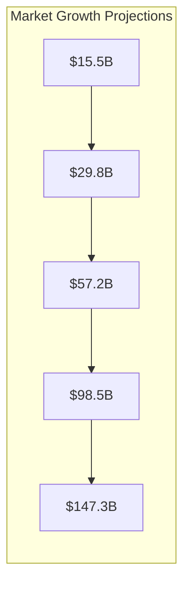
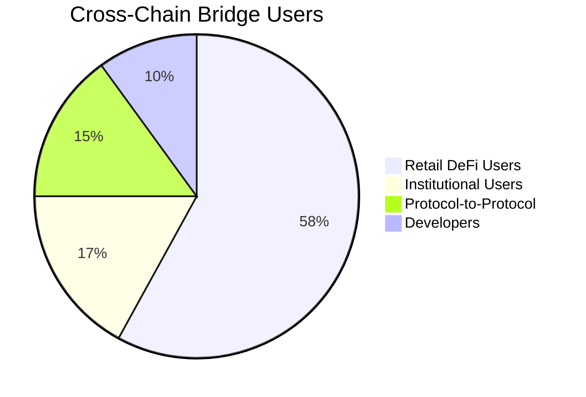
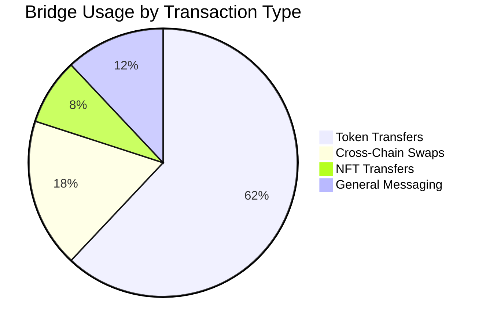
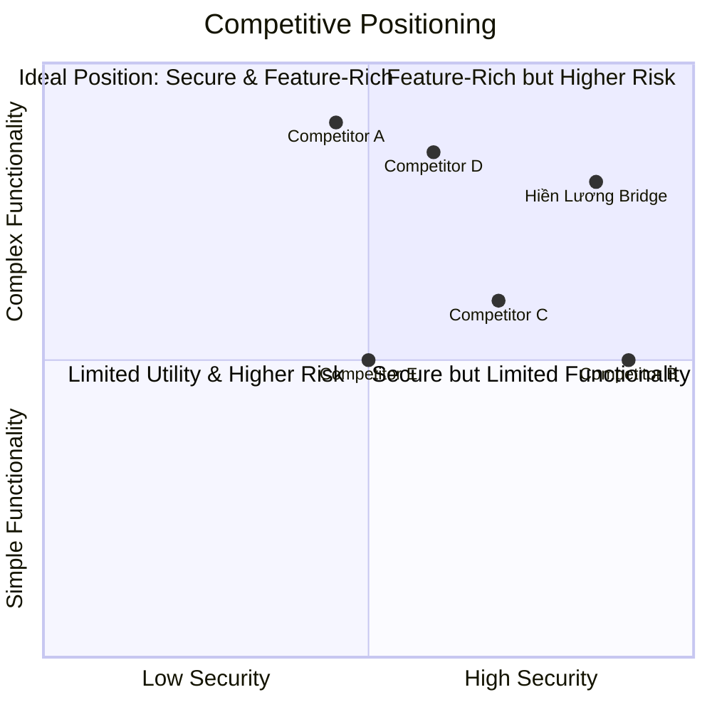

# Hiền Lương Bridge - Market Analysis

  

## Executive Summary

This document presents a comprehensive market analysis for the Hiền Lương Bridge cross-chain protocol, examining the current state of the cross-chain interoperability market, competitive landscape, and growth opportunities. The analysis identifies key market trends and positions Hiền Lương Bridge as a holistic solution addressing critical gaps in the existing cross-chain ecosystem.

## Cross-Chain Market Overview

### Market Size and Growth

The cross-chain interoperability sector has experienced exponential growth in recent years, driven by the proliferation of blockchain networks and the increasing need for seamless asset and data transfers between them.

- **Current Market Size**: Approximately $29.8 billion in Total Value Locked (TVL) across major cross-chain protocols as of 2024
- **Growth Rate**: ~75% year-over-year growth projected through 2027
- **Transaction Volume**: Over $450 billion in annual cross-chain transaction volume
- **User Base**: Estimated 3.2 million monthly active users of cross-chain bridges

### Key Market Drivers

1. **Multi-Chain Reality**: The blockchain ecosystem has evolved from competition for chain dominance to a multi-chain paradigm where different networks serve specialized purposes
2. **DeFi Liquidity Fragmentation**: Capital efficiency demands require assets to flow freely between DeFi ecosystems on different chains
3. **Layer 2 Proliferation**: The growth of Layer 2 scaling solutions has created demand for seamless movement between Layer 1s and various L2s
4. **Institutional Adoption**: Increasing institutional interest in digital assets requires robust cross-chain infrastructure
5. **Developer Experience**: Growing demand for simplified cross-chain development tooling

## Competitive Analysis

### Direct Competitors

| Bridge Protocol | Strengths                                    | Weaknesses                    | Differentiators                  |
| --------------- | -------------------------------------------- | ----------------------------- | -------------------------------- |
| LayerZero       | Advanced messaging protocol, strong security | Limited built-in applications | General infrastructure layer     |
| Axelar          | Wide chain support, GMP protocol             | Complex for developers        | Focus on general message passing |
| Wormhole        | Guardian network, broad ecosystem            | Reliance on guardian network  | Multi-party computation security |
| Across          | Fast finality, low fees                      | Limited chain support         | Optimistic verification model    |
| Stargate        | Unified liquidity pools                      | Limited to token transfers    | Native asset bridging            |
| Synapse         | Cross-chain swaps                            | Token mapping complexity      | Focus on cross-chain swapping    |
| cBridge         | Flash transfers                              | Limited application scope     | Liquidity network approach       |

### SWOT Analysis for Hiền Lương Bridge

#### Strengths

- **Integrated Protocol Suite**: Combines bridging, lending, and staking in one ecosystem
- **Dual Bridge Strategy**: Both normal and adapter modes for maximum flexibility
- **Cross-Chain Capital Efficiency**: Unique lending protocol leveraging cross-chain collateral
- **Developer-Friendly Approach**: Comprehensive SDK and documentation
- **Built on LayerZero**: Leveraging established secure messaging infrastructure

#### Weaknesses

- **Market Entrant Status**: New protocol with need to build reputation and trust
- **Initial Chain Limitations**: Starting with focus on Optimism and Arbitrum
- **Resource Constraints**: Competing against well-funded established protocols

#### Opportunities

- **Cross-Chain DeFi Growth**: Rapidly expanding market for cross-chain DeFi applications
- **Institutional Demand**: Increasing institutional interest in cross-chain capabilities
- **Developer Tooling Gap**: Significant unmet need for better cross-chain developer tools
- **Chain Expansion**: Room to expand to additional chains including non-EVM networks
- **Enterprise Blockchain Integration**: Potential to bridge between public and private networks

#### Threats

- **Security Concerns**: Bridge hacks and exploits have damaged user confidence
- **Regulatory Uncertainty**: Evolving regulatory landscape for cross-chain activities
- **Technological Obsolescence**: Rapid innovation may make current approaches outdated
- **Competition**: Established players with significant resources
- **Chain Consolidation**: Potential for reduced need if chain consolidation occurs

## Market Segmentation

The cross-chain interoperability market can be segmented into several distinct categories:

### By User Type

1. **Retail DeFi Users** (58%): Individual users seeking to access opportunities across multiple chains
2. **Institutional Users** (17%): Institutions requiring secure cross-chain treasury management
3. **Protocol-to-Protocol** (15%): DeFi protocols integrating cross-chain functionality
4. **Developers** (10%): Builders creating cross-chain applications

### By Use Case

1. **Token Transfers** (62%): Simple movement of assets between chains
2. **Cross-Chain Swaps** (18%): Trading between assets native to different chains
3. **NFT Transfers** (8%): Moving non-fungible tokens across chains
4. **General Messaging** (12%): Application-specific cross-chain communication

## Market Positioning

Hiền Lương Bridge is positioned as a comprehensive cross-chain protocol suite that addresses the entire spectrum of cross-chain needs:

### Key Differentiators

1. **Unified Protocol Stack**: Integrated bridge, lending, and staking functionalities
2. **Cross-Chain Capital Efficiency**: Use collateral on one chain to borrow on another
3. **Dual Bridge Strategy**: Both normal (new token representations) and adapter (existing token) modes
4. **Developer-First Approach**: Comprehensive SDK and simplified developer experience
5. **Security-First Implementation**: Multiple layers of security with focus on auditability

## Target Market Strategy

Hiền Lương Bridge will initially focus on the following target segments:

### Primary Target Markets

1. **DeFi Power Users**
   - Profile: Active users managing assets across multiple chains
   - Needs: Low fees, high speed, reliable transfers
   - Strategy: Community engagement, competitive fee structure

2. **DeFi Protocols & DAOs**
   - Profile: Protocols looking to expand cross-chain
   - Needs: Secure treasury management, cross-chain governance
   - Strategy: Strategic partnerships, integration grants

3. **Cross-Chain Developers**
   - Profile: Builders creating multi-chain applications
   - Needs: Simple APIs, robust documentation, reliable infrastructure
   - Strategy: Developer education, comprehensive SDK, hackathons

### Secondary Target Markets

1. **Institutional Users**
   - Profile: Funds and institutions with multi-chain exposure
   - Needs: Security, compliance, transparency
   - Strategy: Institutional-grade features, audits, professional services

2. **NFT Ecosystems**
   - Profile: NFT creators and marketplaces
   - Needs: Seamless cross-chain NFT transfers
   - Strategy: Specialized NFT bridging features, creator partnerships

## Go-to-Market Strategy

### Phase 1: Foundation Building (Q3-Q4 2025)

- Launch core bridge functionality on major L2s (Optimism, Arbitrum)
- Establish security track record with audits and bug bounty programs
- Build developer documentation and SDK
- Initial community building and education

### Phase 2: Expansion & Adoption (Q1-Q2 2026)

- Launch lending protocol with cross-chain collateral functionality
- Expand to additional EVM-compatible chains
- Strategic partnerships with DeFi protocols
- Developer grants program for ecosystem building

### Phase 3: Ecosystem Maturity (Q3-Q4 2026)

- Launch staking and governance functionality
- Integration with institutional custody solutions
- Expansion to non-EVM chains
- Enterprise solutions and partnerships

## Market Growth Opportunities

### Short-term Opportunities (1-2 years)

1. **L2 Ecosystem Growth**: Rapid expansion of L2 networks creates demand for bridges
2. **DeFi Fragmentation**: Growing need to unify liquidity across chains
3. **NFT Cross-Chain Movement**: Increasing demand for NFT interoperability
4. **Cross-Chain Governance**: DAOs requiring multi-chain governance solutions

### Long-term Opportunities (3-5 years)

1. **Institutional Blockchain Adoption**: Enterprises requiring secure cross-chain infrastructure
2. **Cross-Chain Identity Systems**: Unified identity solutions across networks
3. **Blockchain Interoperability Standards**: Leadership in emerging standards
4. **Zero Knowledge Bridge Technology**: Next-generation security with ZK proofs

## Market Challenges and Risks

### Technical Challenges

1. **Security Vulnerabilities**: Bridge exploits have led to significant losses
2. **Scalability Limitations**: Handling high transaction volumes across chains
3. **UX Complexity**: Making cross-chain interactions intuitive for users
4. **Chain-Specific Nuances**: Managing differences in chain architecture

### Market Challenges

1. **User Trust**: Overcoming skepticism from past bridge exploits
2. **Education Gap**: Limited understanding of cross-chain mechanics
3. **Competition**: Established players with significant market share
4. **Regulatory Uncertainty**: Evolving regulatory landscape for bridges

## Conclusion

The cross-chain interoperability market represents one of the fastest-growing and most crucial segments in the blockchain ecosystem. Hiền Lương Bridge is uniquely positioned to address current market gaps with its comprehensive protocol suite, dual bridging strategy, and focus on developer experience.

By combining secure bridge functionality with cross-chain lending and staking capabilities, Hiền Lương Bridge offers a holistic solution to the fragmentation challenges facing the blockchain industry. The project's phased go-to-market strategy allows for sustainable growth while maintaining the highest security standards.

As the blockchain ecosystem continues to evolve toward a multi-chain reality, Hiền Lương Bridge is poised to become a fundamental piece of cross-chain infrastructure enabling the next generation of decentralized applications and services.
