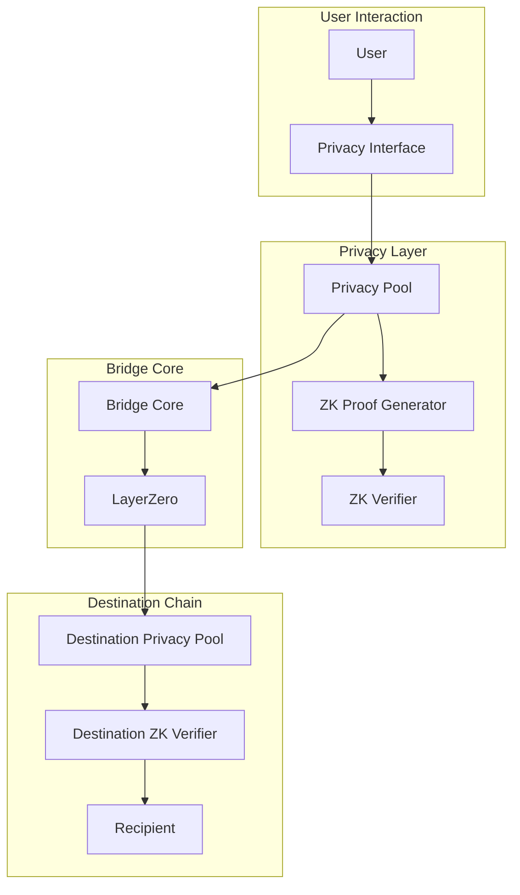
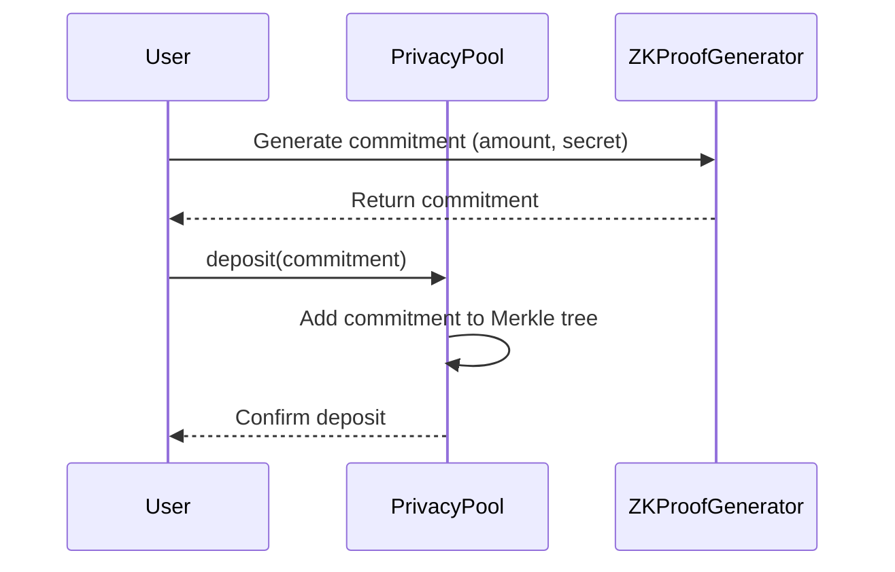
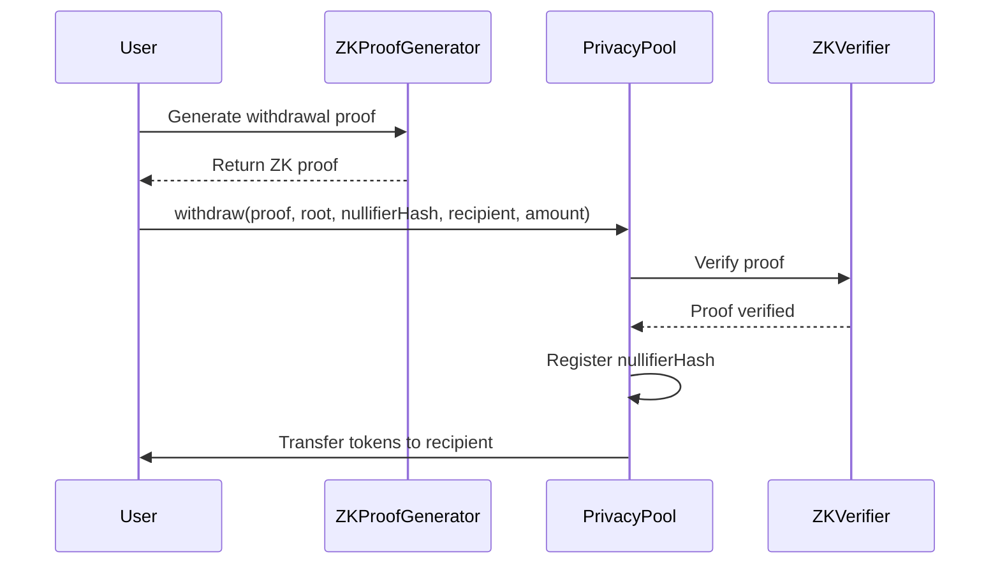
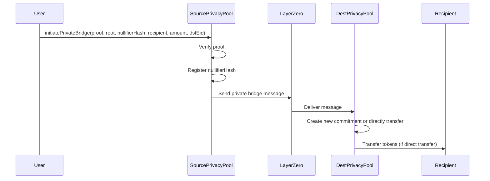

<div align="center">
  <a href="https://github.com/Peace-Foundation">
    
  </a>

  <h1>Hiền Lương Bridge - Privacy Layer</h1>

  <p>
    <strong>Cross-Chain Privacy Implementation</strong>
  </p>
</div>

# Privacy Layer Documentation

## Overview

The Privacy Layer of the Hiền Lương Bridge protocol enables confidential cross-chain transfers using zero-knowledge proofs. This component allows users to transfer assets between chains while maintaining privacy regarding the amount, sender, or receiver information.

## Architecture

The privacy layer integrates with the core bridge infrastructure while adding zero-knowledge cryptography:



## Key Components

### 1. Privacy Pool

The Privacy Pool is a specialized contract that manages private transactions:

```solidity
contract PrivacyPool {
  // Merkle tree for commitments
  mapping(uint256 => bytes32) public commitments;
  uint256 public nextLeafIndex;

  // Nullifiers to prevent double-spending
  mapping(bytes32 => bool) public nullifierHashes;

  // Events
  event Deposit(bytes32 indexed commitment, uint32 leafIndex);
  event Withdrawal(bytes32 indexed nullifierHash, address recipient);

  // Core functions
  function deposit(bytes32 commitment) external;
  function withdraw(
    bytes calldata proof,
    bytes32 root,
    bytes32 nullifierHash,
    address recipient,
    uint256 amount
  ) external;
  function initiatePrivateBridge(
    bytes calldata proof,
    bytes32 root,
    bytes32 nullifierHash,
    address recipient,
    uint256 amount,
    uint32 dstEid
  ) external payable;
}
```

### 2. ZK Proof Generator

The ZK Proof Generator creates zero-knowledge proofs for private transactions:

```typescript
class ZKProofGenerator {
  // Generate a deposit commitment
  async generateCommitment(
    amount: bigint,
    secret: bigint,
  ): Promise<Commitment> {
    // Hash amount and secret to create commitment
    return poseidon([amount, secret]);
  }

  // Generate a withdrawal proof
  async generateWithdrawalProof(
    amount: bigint,
    secret: bigint,
    merkleProof: MerkleProof,
    recipient: string,
  ): Promise<ZKProof> {
    // Create a zero-knowledge proof that:
    // 1. User knows the secret for a commitment in the tree
    // 2. The commitment corresponds to the specified amount
    // ...implementation using the chosen ZK framework
  }
}
```

### 3. ZK Verifier

The ZK Verifier validates zero-knowledge proofs:

```solidity
contract ZKVerifier {
  // Verify a zero-knowledge proof for withdrawal
  function verifyProof(
    bytes calldata proof,
    bytes32 root,
    bytes32 nullifierHash,
    address recipient,
    uint256 amount
  ) external view returns (bool) {
    // Verify the ZK proof using the chosen ZK framework
    // ...implementation details
  }
}
```

## Privacy Protocol

### 1. Private Deposit Flow



### 2. Private Withdrawal Flow



### 3. Private Cross-Chain Transfer Flow



## Zero-Knowledge Implementations

The privacy layer can utilize different zero-knowledge frameworks:

### 1. Noir Implementation

Noir is a domain-specific language for writing zero-knowledge proofs:

```rust
// Noir code for proving commitment ownership
fn main(
    private amount: Field,
    private secret: Field,
    public commitment: Field,
    public nullifier: Field,
    public recipient: Field,
) {
    // Verify the commitment matches
    let computed_commitment = poseidon_hash([amount, secret]);
    assert(computed_commitment == commitment);

    // Verify the nullifier is correct
    let computed_nullifier = poseidon_hash([secret, commitment]);
    assert(computed_nullifier == nullifier);

    // Additional constraints...
}
```

### 2. Circom Implementation

Circom is a language for defining arithmetic circuits:

```circom
pragma circom 2.0.0;

include "node_modules/circomlib/circuits/poseidon.circom";
include "node_modules/circomlib/circuits/comparators.circom";

template Withdrawal() {
    signal input amount;
    signal input secret;
    signal input merkleRoot;
    signal input nullifier;
    signal input recipient;

    signal output valid;

    // Compute the commitment
    component commitmentHasher = Poseidon(2);
    commitmentHasher.inputs[0] <== amount;
    commitmentHasher.inputs[1] <== secret;

    // Verify Merkle proof
    // ...

    // Compute nullifier hash
    component nullifierHasher = Poseidon(2);
    nullifierHasher.inputs[0] <== secret;
    nullifierHasher.inputs[1] <== commitmentHasher.out;

    // Final verification
    valid <== IsEqual()([nullifierHasher.out, nullifier]);
}

component main = Withdrawal();
```

## Privacy Features

### 1. Confidential Amounts

Users can hide the amount of tokens being transferred:

- Deposit any amount into the privacy pool
- Withdraw any combination of amounts that sum to the deposited amount
- Bridge without revealing the exact amount being transferred

### 2. Sender Privacy

Users can hide their identity when sending tokens:

- Deposits create commitments that don't reveal the sender
- Withdrawals can be made to any address without linking to the deposit
- Cross-chain transfers don't reveal the original sender

### 3. Recipient Privacy

Recipients can receive tokens without revealing their identity:

- Recipients can be specified using stealth addresses
- Tokens can be claimed using zero-knowledge proofs
- Multiple withdrawals from the same deposit are unlinkable

## Security Considerations

The privacy layer incorporates several security measures:

1. **Nullifier System**: Prevents double-spending of commitments
2. **Merkle Tree Verification**: Ensures commitments were properly deposited
3. **Circuit Auditing**: Thorough verification of ZK circuits
4. **Formal Verification**: Mathematical validation of privacy properties
5. **Minimum Anonymity Set**: Required minimum number of deposits before withdrawals

## Implementation Roadmap

The privacy layer will be implemented in phases:

1. **Phase 1: Research & Design** (Q3-Q4 2026)
   - Selection of ZK framework
   - Circuit design and optimization
   - Protocol specification

2. **Phase 2: Implementation** (Q1-Q2 2027)
   - Development of ZK circuits
   - Implementation of smart contracts
   - Client-side proof generation

3. **Phase 3: Testing & Auditing** (Q2-Q3 2027)
   - Security audits of ZK circuits
   - Formal verification of privacy properties
   - Testnet deployment

4. **Phase 4: Mainnet Launch** (Q4 2027)
   - Limited mainnet release
   - Progressive anonymity set growth
   - Full privacy feature rollout

## Compliance Considerations

The privacy layer is designed with regulatory compliance in mind:

1. **Optional Transparency**: Users can choose to disclose transaction details
2. **Viewing Keys**: Support for selective disclosure to authorized parties
3. **Compliance Mode**: Optional integration with KYC/AML providers
4. **Threshold Controls**: Limits on private transaction sizes based on risk profiles

## Future Enhancements

The privacy layer is designed to support future enhancements:

1. **Multi-Asset Privacy**: Support for private transfers of multiple assets
2. **Private DeFi**: Integration with privacy-preserving DeFi protocols
3. **Advanced ZK Features**: Recursive proofs for enhanced privacy
4. **Private NFT Transfers**: Extensions for non-fungible token privacy
5. **Hardware Acceleration**: Optimization for faster proof generation
