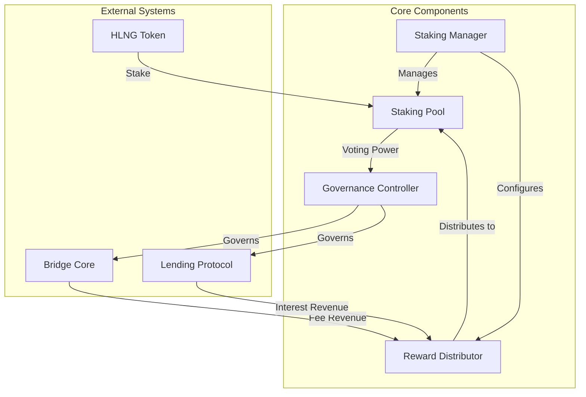
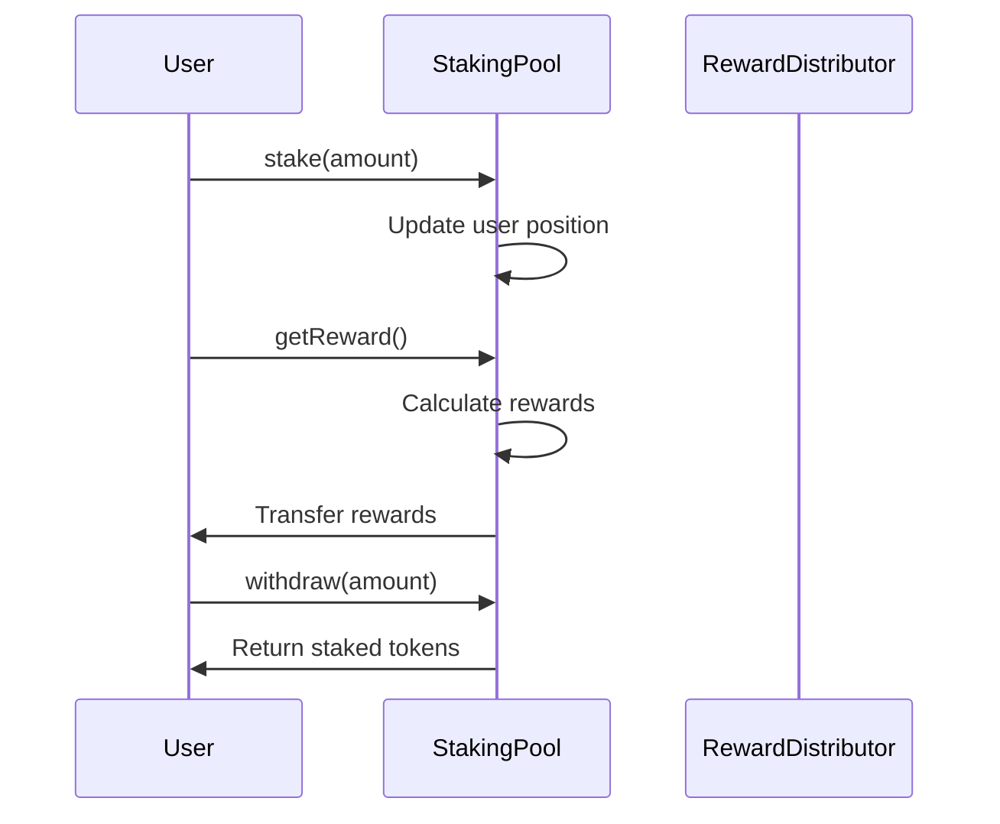
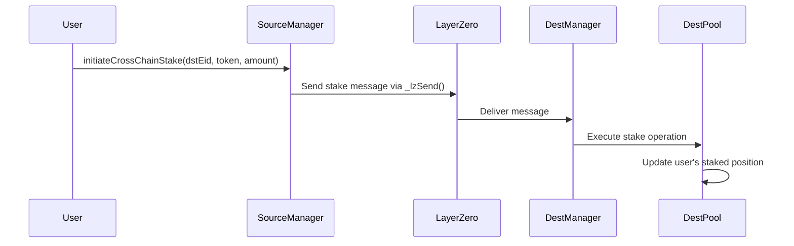

<div align="center">
  <a href="https://github.com/Peace-Foundation">
    
  </a>

  <h1>Hiền Lương Bridge - Staking Protocol</h1>

  <p>
    <strong>Cross-Chain Staking System</strong>
  </p>
</div>

# Protocol Staking Documentation

## Overview

The Staking Protocol is a vital component of the Hiền Lương Bridge ecosystem, providing security, incentivization, and governance capabilities. It allows users to stake tokens across multiple chains, earn rewards, and participate in protocol governance.

## System Architecture

The Staking Protocol consists of several interconnected components:



### Key Components

1. **Staking Manager**: Central contract that coordinates the staking system
   - Configures staking parameters
   - Manages staking pools
   - Controls reward distribution
   - Handles cross-chain staking operations

2. **Staking Pool**: Holds staked tokens and tracks user positions
   - Accepts token deposits
   - Tracks staking positions
   - Calculates rewards
   - Provides liquidity for protocol operations

3. **Reward Distributor**: Manages the collection and distribution of rewards
   - Collects fees from bridge operations
   - Accumulates interest from the lending protocol
   - Distributes rewards to stakers
   - Supports multiple reward tokens

4. **Governance Controller**: Enables protocol governance by stakers
   - Proposal creation and voting
   - Parameter adjustment
   - Protocol upgrades
   - Emergency controls

## Contract Design

### StakingManager Contract

```solidity
contract StakingManager is OApp {
  // Staking pools by chain and token
  mapping(uint32 => mapping(address => address)) public stakingPools;

  // Governance settings
  address public governanceController;

  // Cross-chain staking settings
  mapping(uint32 => bool) public supportedChains;

  // Events
  event StakingPoolCreated(uint32 chainEid, address token, address pool);
  event CrossChainStakeInitiated(address user, uint32 dstEid, uint256 amount);

  // Core functions
  function createStakingPool(address token) external;
  function initiateCrossChainStake(
    uint32 dstEid,
    address token,
    uint256 amount
  ) external payable;
  function _lzReceive(
    uint32 _srcEid,
    bytes32 _srcAddress,
    bytes calldata _payload
  ) internal override;
}
```

### StakingPool Contract

```solidity
contract StakingPool {
  // Token being staked
  IERC20 public stakingToken;

  // Staking positions
  mapping(address => uint256) public stakedBalance;
  uint256 public totalStaked;

  // Reward tracking
  mapping(address => uint256) public userRewardPerTokenPaid;
  mapping(address => uint256) public rewards;
  uint256 public rewardPerTokenStored;

  // Events
  event Staked(address indexed user, uint256 amount);
  event Withdrawn(address indexed user, uint256 amount);
  event RewardPaid(address indexed user, uint256 reward);

  // Core functions
  function stake(uint256 amount) external;
  function withdraw(uint256 amount) external;
  function getReward() external;
  function exit() external;
}
```

### RewardDistributor Contract

```solidity
contract RewardDistributor {
  // Reward token
  IERC20 public rewardToken;

  // Reward rate settings
  uint256 public rewardRate;
  uint256 public periodFinish;
  uint256 public lastUpdateTime;

  // Staking pools eligible for rewards
  mapping(address => bool) public stakingPools;

  // Events
  event RewardAdded(uint256 reward);
  event PoolAdded(address indexed pool);
  event PoolRemoved(address indexed pool);

  // Core functions
  function notifyRewardAmount(uint256 reward) external;
  function addStakingPool(address pool) external;
  function removeStakingPool(address pool) external;
  function distributeRewards() external;
}
```

### Governance Controller

```solidity
contract GovernanceController {
  // Proposal tracking
  struct Proposal {
    uint256 id;
    address proposer;
    string description;
    bytes[] calldatas;
    address[] targets;
    uint256 startBlock;
    uint256 endBlock;
    uint256 forVotes;
    uint256 againstVotes;
    bool executed;
    mapping(address => bool) hasVoted;
  }

  mapping(uint256 => Proposal) public proposals;
  uint256 public proposalCount;

  // Voting power source
  IStakingPool public stakingPool;

  // Events
  event ProposalCreated(uint256 id, address proposer, string description);
  event VoteCast(
    address indexed voter,
    uint256 proposalId,
    bool support,
    uint256 weight
  );
  event ProposalExecuted(uint256 id);

  // Core functions
  function propose(
    address[] memory targets,
    bytes[] memory calldatas,
    string memory description
  ) external returns (uint256);
  function castVote(uint256 proposalId, bool support) external;
  function execute(uint256 proposalId) external;
}
```

## Staking Process

### Basic Staking Flow



### Cross-Chain Staking Flow



## Reward Mechanisms

The staking protocol implements multiple reward mechanisms:

### 1. Base Staking Rewards

Stakers earn base rewards from protocol inflation according to their share of the staking pool:

```
userReward = (stakedBalance / totalStaked) * rewardRate * timePassed
```

### 2. Fee Sharing

A portion of the fees collected from bridge operations is distributed to stakers:

```
feeReward = (stakedBalance / totalStaked) * collectedFees * feeSharePercentage
```

### 3. Governance Rewards

Active participants in governance receive additional rewards for voting and proposal creation.

## Governance Process

The governance process follows these steps:

1. **Proposal Creation**: Users with sufficient staking can create proposals
2. **Voting Period**: Stakeholders vote for or against proposals during a voting period
3. **Execution**: If approved, proposals can be executed after the voting period ends
4. **Implementation**: The protocol parameters or contracts are updated based on the proposal

## Security Considerations

The staking protocol implements several security measures:

1. **Timelock Mechanisms**: Delays for critical parameter changes
2. **Slashing Conditions**: Penalties for malicious behavior
3. **Emergency Controls**: Ability to pause functions in case of emergencies
4. **Vote Delegation**: Allow users to delegate voting power
5. **Quorum Requirements**: Minimum participation thresholds for proposals

## Protocol Parameters

| Parameter          | Description                            | Default Value  |
| ------------------ | -------------------------------------- | -------------- |
| Minimum Stake      | Minimum amount required to stake       | 100 HLNG       |
| Unstaking Delay    | Time required to unstake tokens        | 7 days         |
| Reward Rate        | Base emission rate for rewards         | 1,000 HLNG/day |
| Fee Share          | Percentage of fees shared with stakers | 80%            |
| Proposal Threshold | Minimum stake to create proposals      | 10,000 HLNG    |
| Voting Period      | Duration of voting on proposals        | 3 days         |

## Future Enhancements

The staking protocol is designed to support future enhancements:

1. **Liquid Staking**: Tokenized staking positions that can be transferred or used in DeFi
2. **Delegated Validation**: Role-based validation for cross-chain message verification
3. **Tiered Staking**: Different tiers of staking with varying benefits
4. **Quadratic Voting**: Weighted voting system to prevent large stake dominance
5. **Cross-Chain Governance**: Unified governance across multiple chains
