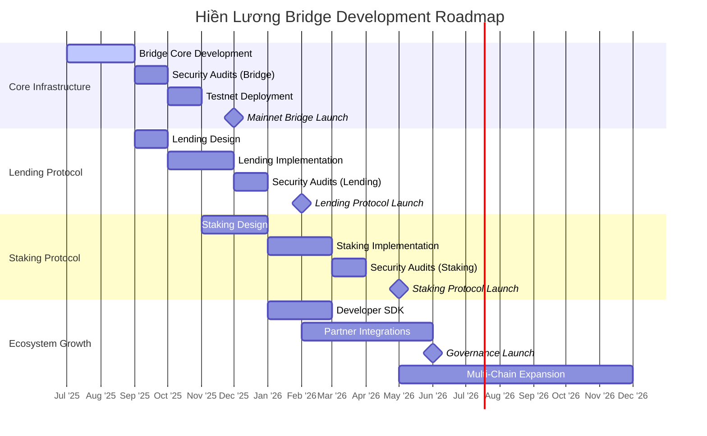

# Hiền Lương Bridge - Technical Roadmap

  

## Development Timeline

The Hiền Lương Bridge protocol will be developed in a phased approach, starting with the core bridge functionality and progressively adding advanced features.

## Phase 1: Bridge Core (Q3-Q4 2025)

### Milestone 1: Core Bridge Implementation

- Development of BridgeCore contract
- Implementation of token bridge contracts (OFT, ONFT)
- LayerZero protocol integration
- Internal testing and optimization

### Milestone 2: Security & Testing

- Complete security reviews
- Extensive unit and integration testing
- Public testnet deployment
- Bug bounty program

### Milestone 3: Mainnet Launch

- Initial deployment on Optimism and Arbitrum
- Launch of fungible token bridging functionality
- Documentation and SDK
- Community onboarding and education

## Phase 2: Lending Protocol (Q4 2025 - Q1 2026)

### Milestone 1: Lending Design & Implementation

- Development of SourcePool contract
- Development of DestinationPool contract
- Integration of price oracle systems
- Cross-chain interest rate models

### Milestone 2: Security & Testing

- Security audits of lending protocol
- Economic model testing
- Lending protocol testnet
- Integration with existing DeFi protocols

### Milestone 3: Lending Protocol Launch

- Mainnet deployment of lending protocol
- Initial supported assets launch
- Risk management framework
- Lending analytics dashboard

## Phase 3: Staking Protocol (Q1-Q2 2026)

### Milestone 1: Staking Design & Implementation

- Development of staking contracts
- Implementation of reward distribution system
- Governance mechanism design
- Cross-chain staking functionality

### Milestone 2: Security & Testing

- Security audits of staking protocol
- Testing of governance mechanisms
- Staking economics modeling
- Integration with bridge and lending components

### Milestone 3: Staking Protocol Launch

- Mainnet deployment of staking protocol
- Governance token distribution
- Initial governance proposals
- Community expansion

## Phase 4: Ecosystem Growth (Q2-Q4 2026)

### Milestone 1: Developer Ecosystem

- Comprehensive SDK development
- Developer documentation and tutorials
- Integration examples and templates
- Grants program for ecosystem developers

### Milestone 2: Partner Integrations

- Strategic partnerships with DeFi protocols
- Integration with major wallets and dApps
- Cross-chain liquidity partnerships
- Enterprise solutions development

### Milestone 3: Multi-Chain Expansion

- Support for additional EVM chains
- Implementation of non-EVM chain bridges
- Layer 2 optimization and integration
- Specialized bridges for specific ecosystems

## Technical Delivery Plan

### Bridge Core Components

| Component                    | Status         | Priority | Dependencies          |
| ---------------------------- | -------------- | -------- | --------------------- |
| BridgeCore Contract          | In Development | High     | LayerZero Integration |
| NormalOFT Implementation     | In Development | High     | None                  |
| AdapterOFT Implementation    | In Development | High     | None                  |
| NormalONFT Implementation    | In Development | Medium   | None                  |
| AdapterONFT Implementation   | In Development | Medium   | None                  |
| BridgeFactory Contract       | In Development | Medium   | All Bridge Contracts  |
| Cross-Chain Message Handling | Planned        | High     | LayerZero Integration |
| Fee Management System        | Planned        | Medium   | BridgeCore Contract   |

### Lending Protocol Components

| Component                 | Status  | Priority | Dependencies           |
| ------------------------- | ------- | -------- | ---------------------- |
| SourcePool Contract       | Planned | High     | BridgeCore Integration |
| DestinationPool Contract  | Planned | High     | BridgeCore Integration |
| Price Oracle Integration  | Planned | High     | None                   |
| Interest Rate Models      | Planned | Medium   | None                   |
| Liquidation System        | Planned | High     | Price Oracle           |
| Risk Management Framework | Planned | High     | All Lending Components |

### Staking Protocol Components

| Component                  | Status  | Priority | Dependencies            |
| -------------------------- | ------- | -------- | ----------------------- |
| StakingManager Contract    | Planned | Medium   | Bridge & Lending Launch |
| StakingPool Contract       | Planned | Medium   | None                    |
| RewardDistributor Contract | Planned | Medium   | Fee Collection System   |
| Governance Controller      | Planned | Low      | All Protocol Components |

## Infrastructure Requirements

### Development Environment

- Hardhat development framework
- Foundry for Solidity-based testing
- CI/CD pipeline for automated testing
- Code coverage and static analysis tools

### Testing Infrastructure

- Local development networks
- Testnet deployments (Optimism Sepolia, Arbitrum Sepolia)
- Monitoring and alerting systems
- Performance benchmarking tools

### Production Infrastructure

- Secure deployment process
- Multi-signature contract administration
- Monitoring and analytics dashboard
- Emergency response system

## Risk Factors and Mitigations

### Technical Risks

| Risk                           | Severity | Mitigation Strategy                              |
| ------------------------------ | -------- | ------------------------------------------------ |
| Smart Contract Vulnerabilities | High     | Multiple audits, bug bounty, formal verification |
| Cross-Chain Message Failures   | High     | Robust retry mechanisms, monitoring              |
| Oracle Manipulation            | Medium   | Multiple data sources, circuit breakers          |
| Gas Price Volatility           | Medium   | Dynamic fee adjustment, gas reserves             |
| Network Congestion             | Medium   | Priority fee mechanisms, transaction monitoring  |

### Operational Risks

| Risk                   | Severity | Mitigation Strategy                    |
| ---------------------- | -------- | -------------------------------------- |
| Key Management Failure | High     | Multi-signature controls, key rotation |
| Governance Attacks     | Medium   | Time-locked execution, guardian role   |
| Insufficient Liquidity | Medium   | Liquidity incentive programs           |
| Regulatory Changes     | Medium   | Legal counsel, compliance reviews      |
| Market Volatility      | Medium   | Risk parameters, insurance fund        |

## Success Metrics

The success of the Hiền Lương Bridge protocol will be measured by the following key metrics:

1. **Total Value Locked (TVL)** - Amount of assets secured in the protocol
2. **Bridge Transaction Volume** - Number and value of cross-chain transfers
3. **Active Users** - Daily and monthly active users
4. **Protocol Revenue** - Fees generated from bridge and lending operations
5. **Integration Count** - Number of protocols integrated with Hiền Lương Bridge
6. **Developer Adoption** - Projects built using the protocol's infrastructure
7. **Cross-Chain Coverage** - Number of supported blockchain networks
