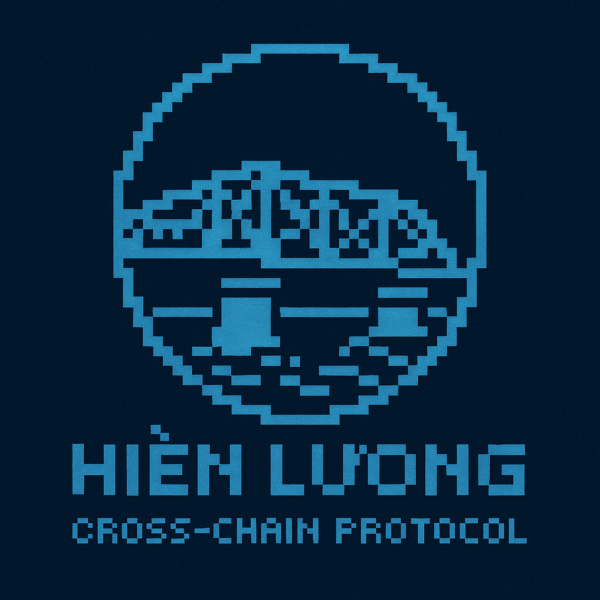

# Hiền Lương Bridge: A Cross-Chain Protocol for the Multi-Chain Future

<div align="center">
  
  <h3>Version 1.0 - August 2025</h3>
</div>

## Abstract

As blockchain technology evolves toward a multi-chain future, the need for secure, efficient, and flexible cross-chain infrastructure becomes increasingly critical. Hiền Lương Bridge presents a comprehensive cross-chain protocol that enables seamless asset transfers, cross-chain lending, and protocol staking across multiple blockchain networks. This paper introduces the architecture, mechanisms, and security features of the Hiền Lương Bridge protocol, which combines proven cryptographic techniques with innovative protocol design to create a robust foundation for the interconnected blockchain ecosystem.

## 1. Introduction

### 1.1 The Multi-Chain Challenge

The blockchain ecosystem has evolved from a competition for chain dominance to a multi-chain paradigm where different networks serve specialized purposes. This evolution has created significant challenges:

1. **Fragmented Liquidity**: Capital is siloed across dozens of blockchain networks
2. **User Experience Friction**: Managing assets across chains creates complexity
3. **Developer Barriers**: Building cross-chain applications requires specialized expertise
4. **Security Concerns**: Cross-chain operations introduce new security vulnerabilities
5. **Capital Inefficiency**: Assets cannot be efficiently utilized across chains

### 1.2 The Hiền Lương Bridge Solution

Named after the historic bridge that once connected North and South Vietnam, Hiền Lương Bridge is designed to unite the fragmented blockchain landscape with a comprehensive protocol stack:

1. **Bridge Core**: Secure and efficient asset transfers between chains
2. **Cross-Chain Lending**: Utilize collateral on one chain to borrow on another
3. **Protocol Staking**: Security and governance layer for protocol participants

The protocol implements multiple bridging strategies, adapting to the specific needs of different asset types and use cases:

- **Normal Mode**: Creates new token representations on destination chains
- **Adapter Mode**: Bridges existing tokens between chains
- **Privacy Mode**: Enables confidential cross-chain transfers (future implementation)

## 2. Protocol Architecture

### 2.1 System Overview

The Hiền Lương Bridge protocol consists of three integrated components:


### 2.2 Bridge Core

The Bridge Core is the fundamental component enabling cross-chain asset transfers:

#### 2.2.1 Key Components

- **BridgeCore Contract**: Manages bridge instances and coordinates transfers
- **Token Bridge Protocols**: Specialized contracts for different token types
- **BridgeFactory**: Contract factory for easy deployment of bridge components

#### 2.2.2 Data Structures

```solidity
// Fungible token information
struct FungibleTokenData {
  address contractAddress;
  bool needAdaptation;
  bool isRegistered;
  uint256 totalBridged;
}

// Non-fungible token information
struct NonFungibleTokenData {
  address contractAddress;
  bool needAdaptation;
  bool isRegistered;
  uint256 totalBridged;
}

// Bridge instance data
struct BridgeData {
  address owner;
  uint256 bridgeId;
  string name;
  string description;
  uint256 createdAt;
  bool isActive;
  uint256 totalTransactions;
}
```

#### 2.2.3 Bridge Modes

**Normal Mode**:

- Creates new token representations on destination chains
- Original tokens are locked in the source chain contract
- New tokens are minted on the destination chain
- Ideal for expanding token usage to new ecosystems

**Adapter Mode**:

- Bridges existing tokens between chains where they already exist
- Tokens are locked in the adapter contract on the source chain
- Corresponding tokens are unlocked on the destination chain
- Optimal for established tokens with existing liquidity

### 2.3 Cross-Chain Lending

The Lending Protocol enables capital efficiency across chains:

#### 2.3.1 Key Components

- **SourcePool**: Manages deposits and collateral on the source chain
- **DestinationPool**: Handles borrowing on the destination chain
- **Oracle**: Provides reliable price feeds for assets

#### 2.3.2 Cross-Chain Lending Flow


#### 2.3.3 Interest Rate Model

The lending protocol uses a dynamic interest rate model based on utilization:

```
Utilization = Total Borrowed / Total Deposits

If Utilization <= kink:
    BorrowRate = baseRate + Utilization * multiplier
Else:
    BorrowRate = baseRate + kink * multiplier + (Utilization - kink) * jumpMultiplier

Where:
- baseRate: Minimum borrowing rate when utilization is 0%
- multiplier: Rate of increase in the borrowing rate as utilization increases
- kink: Utilization threshold where the rate increase accelerates
- jumpMultiplier: Higher rate multiplier after passing the kink
```

### 2.4 Protocol Staking

The Staking Protocol secures the bridge and aligns incentives:

#### 2.4.1 Key Components

- **StakingManager**: Central contract coordinating the staking system
- **StakingPool**: Contract holding staked tokens and tracking positions
- **RewardDistributor**: Manages the collection and distribution of rewards
- **GovernanceController**: Enables protocol governance by stakers

#### 2.4.2 Reward Mechanisms

Stakers earn rewards from multiple sources:

- Protocol inflation based on predefined schedule
- Fee sharing from bridge operations
- Interest share from lending protocol

#### 2.4.3 Governance Process

The protocol implements on-chain governance through a proposal and voting system:

1. **Proposal Creation**: Users with sufficient staking can create proposals
2. **Voting Period**: Stakeholders vote for or against proposals
3. **Execution**: If approved, proposals are executed after the voting period
4. **Implementation**: Protocol parameters or contracts are updated

## 3. Cross-Chain Messaging

### 3.1 LayerZero Integration

Hiền Lương Bridge leverages LayerZero's Ultra Light Node (ULN) protocol for secure cross-chain messaging:

1. **Message Passing**: Uses OApp framework for consistent message handling
2. **Endpoint Configuration**: Each contract connects to chain-specific endpoints
3. **Execution Options**: Configurable options for cross-chain execution
4. **Verification**: Multiple validation mechanisms to ensure message integrity

### 3.2 Message Format

Cross-chain messages use a standardized format for consistency:

```solidity
struct BridgeMessage {
  uint256 bridgeId;
  address tokenAddress;
  uint256 amount;
  uint256 tokenId;
  address from;
  address to;
  bool isFungible;
}
```

### 3.3 Message Verification

Messages are verified using multiple mechanisms:

1. **Source Authentication**: Ensures messages come from trusted sources
2. **Message Integrity**: Confirms messages haven't been tampered with
3. **Execution Validation**: Verifies appropriate execution parameters

## 4. Security Architecture

### 4.1 Security Principles

The protocol implements a defense-in-depth security approach:

1. **Minimize Trust Assumptions**: Reduce reliance on trusted parties
2. **Layered Defenses**: Multiple security mechanisms at different protocol layers
3. **Formal Verification**: Mathematical validation of critical components
4. **Graceful Failure**: Contain potential damage if vulnerabilities are exploited
5. **Transparent Operation**: Enable monitoring and verification of all operations

### 4.2 Security Mechanisms

#### 4.2.1 Bridge Security

- **Message Verification**: Multi-layer verification of cross-chain messages
- **Token Validation**: Rigorous validation of token contracts
- **Circuit Breakers**: Automatic pausing if anomalous activity is detected
- **Timelocks**: Delays for critical parameter changes

#### 4.2.2 Lending Security

- **Collateralization Requirements**: Conservative collateralization ratios
- **Liquidation Mechanisms**: Efficient liquidation processes to maintain solvency
- **Oracle Security**: Multiple data sources with deviation checks
- **Risk Parameters**: Chain-specific risk assessment and parameters

#### 4.2.3 Staking Security

- **Slashing Conditions**: Penalties for malicious behavior
- **Gradual Withdrawals**: Time-delayed unstaking to prevent sudden liquidity shifts
- **Governance Safeguards**: Quorum requirements and proposal review periods

### 4.3 Audit Strategy

The protocol undergoes comprehensive security audits:

1. **Static Analysis**: Automated scanning for common vulnerabilities
2. **Formal Verification**: Mathematical proof of critical protocol properties
3. **Expert Review**: Multiple independent audit firms
4. **Bug Bounty Program**: Incentivized vulnerability disclosure
5. **Economic Attack Analysis**: Examination of economic security assumptions

## 5. Protocol Economics

### 5.1 Fee Structure

The protocol generates revenue through several mechanisms:

1. **Bridge Fees**: Small percentage fee on cross-chain transfers
2. **Lending Interest Spread**: Portion of interest rate spread from lending protocol
3. **Protocol Services**: Premium features for institutional and enterprise users

### 5.2 Token Economics

The HLNG token serves multiple purposes in the ecosystem:

1. **Governance**: Voting rights for protocol parameters and upgrades
2. **Fee Discounts**: Reduced fees for token holders
3. **Staking Rewards**: Share of protocol revenue for stakers
4. **Collateral**: Enhanced LTV ratios when used as collateral
5. **Protocol Security**: Economic security layer for the bridge

### 5.3 Value Flows


## 6. Use Cases and Applications

### 6.1 DeFi Applications

- **Cross-Chain Yield Farming**: Access yield opportunities across chains
- **Liquidity Aggregation**: Combine liquidity from multiple chains
- **Risk Diversification**: Spread assets across different ecosystems

### 6.2 DAO Treasury Management

- **Multi-Chain Asset Management**: Manage DAO assets across multiple chains
- **Cross-Chain Governance**: Execute governance decisions across chains
- **Treasury Diversification**: Distribute treasury holdings for security

### 6.3 Enterprise Applications

- **Cross-Chain Settlement**: Settle transactions across multiple blockchain networks
- **Multi-Network Operations**: Operate business processes across chains
- **Regulatory Compliance**: Maintain compliance across different jurisdictions

### 6.4 NFT Ecosystems

- **Cross-Chain NFT Markets**: Trade NFTs across different chains
- **Unified Collections**: Manage collections spanning multiple networks
- **Cross-Chain Royalties**: Collect creator royalties across ecosystems

## 7. Roadmap and Future Development

### 7.1 Development Phases


### 7.2 Future Enhancements

The protocol is designed for future expansion:

1. **Privacy Layer**: Zero-knowledge proof technology for private transfers
2. **Multi-Chain Smart Contracts**: Contracts that operate across multiple chains
3. **Cross-Chain DAOs**: Governance mechanisms spanning multiple networks
4. **Layer 2 Optimization**: Specialized support for Layer 2 scaling solutions
5. **Non-EVM Integration**: Support for non-EVM blockchains

## 8. Governance

### 8.1 Governance Philosophy

The governance model is based on three principles:

1. **Progressive Decentralization**: Gradual transition to community governance
2. **Expertise-Based Decision Making**: Specialized councils for technical decisions
3. **Stakeholder Alignment**: Incentives aligned across all stakeholder groups

### 8.2 Governance Process

1. **Proposal Creation**: Proposals can be created by users with sufficient stake
2. **Discussion Period**: Community discussion and refinement
3. **Formal Voting**: On-chain voting by token holders
4. **Implementation**: Execution of approved proposals

### 8.3 Governance Parameters

| Parameter          | Description                       | Initial Value        |
| ------------------ | --------------------------------- | -------------------- |
| Proposal Threshold | Minimum stake to create proposals | 10,000 HLNG          |
| Voting Period      | Duration of voting on proposals   | 3 days               |
| Quorum             | Minimum participation required    | 10% of staked tokens |
| Approval Threshold | Required support for approval     | 66%                  |
| Timelock Delay     | Delay before implementation       | 2 days               |

## 9. Conclusion

Hiền Lương Bridge represents a significant advancement in cross-chain infrastructure, providing a comprehensive solution to the challenges of the multi-chain blockchain ecosystem. By combining secure bridge functionality with cross-chain lending capabilities and aligned protocol governance, Hiền Lương Bridge creates a foundation for the next generation of blockchain applications.

The protocol's modular architecture, security-first design, and economic mechanisms create a sustainable and evolving cross-chain ecosystem. As blockchain technology continues to develop toward greater specialization and interconnectivity, Hiền Lương Bridge stands ready to fulfill its namesake's purpose: connecting disparate ecosystems into a unified whole.

## References

1. LayerZero: Trustless Omnichain Interoperability Protocol
2. Ethereum: A Next-Generation Smart Contract and Decentralized Application Platform
3. Compound: The Money Market Protocol
4. Uniswap: A Protocol for Automated Token Exchange
5. Aave: The Liquidity Protocol
